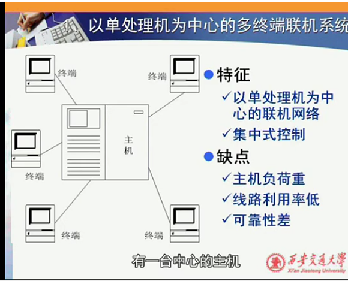
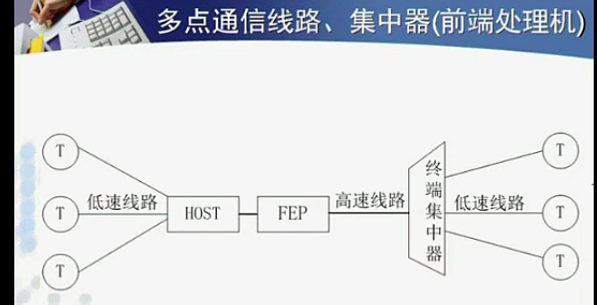
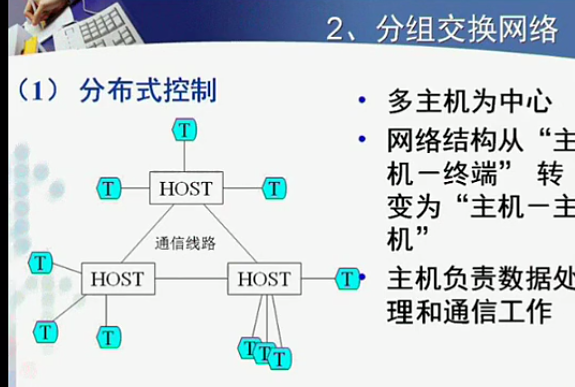
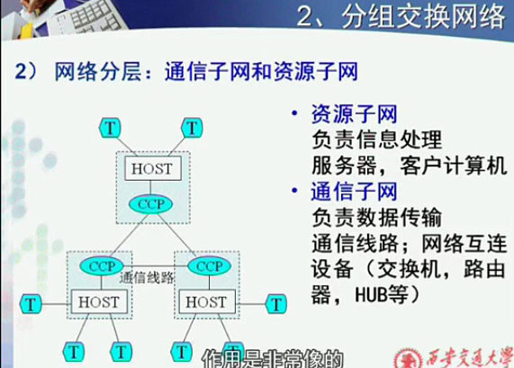

课程视频：
>http://v.youku.com/v_show/id_XNjAzMTcxNzQ0.html

## 课程目标
1. 了解计算机网络的基本概念
  - 什么是计算机网络定义
  - 计算机网络需要哪些硬件支持、软件保障
  - 计算机网络的分类
2. 理解计算机网络体系结构的分层原理
  - 计算机与计算机交谈类比*人与人交谈*
    - 两个点信息的传输
      - 交谈目的是什么，共同关心的话题
      - 交谈的语言是什么
        - 通讯的规则
  - **分层模型**：把复杂的问题划分为简单的问题

3. 掌握计算机网络的基本工作原理和主要技术
  - 每一**层**完成什么功能，提供什么服务，如何实现
    - *差错控制*：发现差错、恢复差错，how？
4. 掌握以TCP/IP协议集为基础的Internet网络
  - TCP、IP关系是什么，如何协调，与应用层协议关系
5. 了解计算机网络发展的历史与新技术
6. **目标：掌握分析问题和解决问题的能力**
  - 从哪里下手熟悉，如何快速学习掌握
  - 设计协议：简单的、高效的、完善的

## 课程章节
章节改变：由“层”的分类→面向应用

# 计算机网络的概述
## 计算机网络的定义
##### 例：如何组建一个网络
*两台计算机，如何连成网络，完成信息交互*
  - 硬件支持-物理层面
    - 网络接口：网卡、蓝牙收发器、无线网卡
    - 物理层面：双绞线、蓝牙、WiFi
  - 软件
    - TCP/IP 协议集——通讯规则
    - 通讯的目的：应用

##### 定义：
**能够以相互共享资源的方式互联起来的自治计算机系统的集合**
##### 三个特征：
  - 资源共享——原始推动力、主要功能、主要目标
  - 分布在不同地理位置的“自治系统”
    - 自治系统：不受制于其他节点
  - 遵循一定的规则——“协议”（逻辑层面）
    - 才能够接受、识别、理解对方的数据

## 计算机网络的发展历史
##### 掌握的重点
  - 演变过程
  - 现代计算机网络如何工作
#### 计算机历史（简）
##### 起源于军事推动的发展：体积大、价格昂贵
  - 背景：
    - 大型机采用批处理 按顺序将多个任务依次执行，再依次分发结果
    - 实时性差

**第一阶段**
  - 解决方案：以单处理机为中心的多终端联机系统
  
    - 问题
      - 不是自制系统（终端只负责I/O）
      - 可靠性差
        - 依赖主机，容易瘫痪
        - **集中式**
  - 优化方案：
  
    - FEP：前端处理机：通信与信息处理分开
      - 决定前端是否提交主机
      - 转换成主机理解的格式
      - 接收主机信息，及决定发送
    - 低速线路——高速线路：资源浪费
    - **可靠性：解决不了**

**第二阶段**
  - 方案：ARPAnet
  
    - 里程碑：
      - 现代网络的原型
      - Internet网络发展起来的
    - **分布式控制**
      - 自治性的
      - 麻烦：主机间的通信问题
  - 优化方案：
  
    - CCP：通信控制处理器：通信、处理分开
    - **实现了网络分层**
      - 资源子网：数据给通讯子网就好
      - 通讯子网：数据是什么不重要，送到哪里、如何转发
    - 问题：采用了全互联结构：所有节点全部相连

**集中→分布**
**通讯、计算分开**

## 计算机网络的分类
## 计算机网络的结构
## 标准化组织
