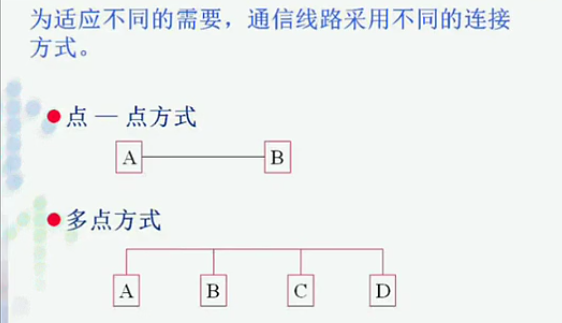
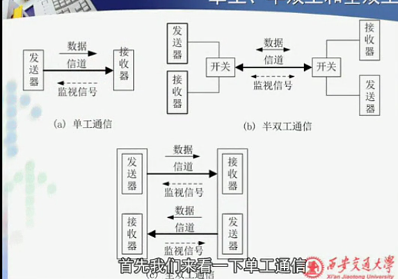
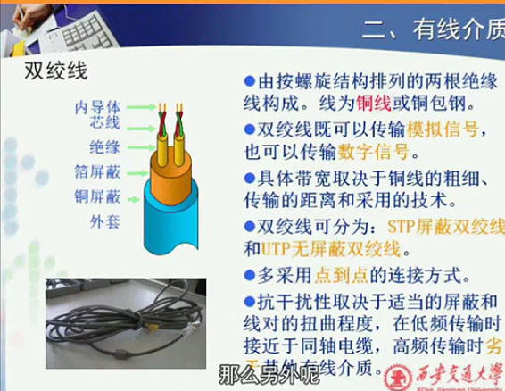
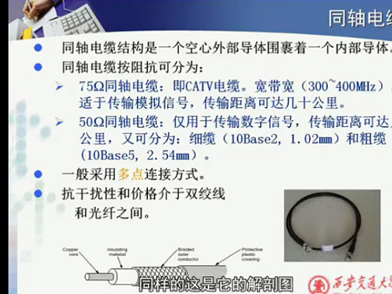
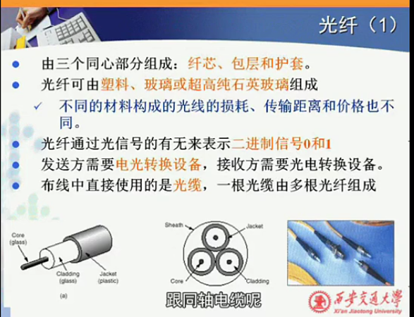
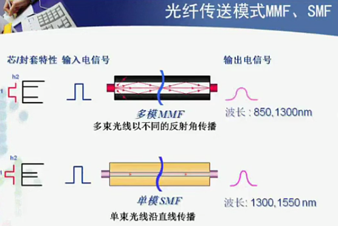
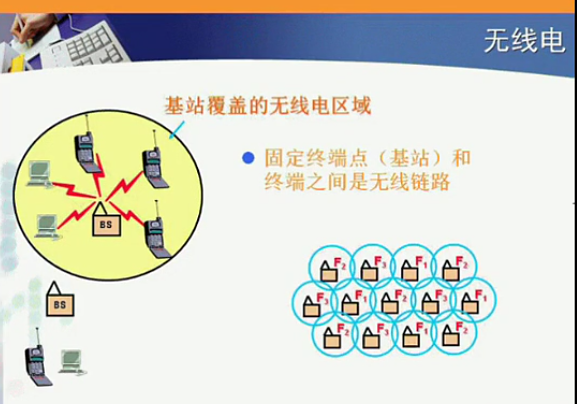
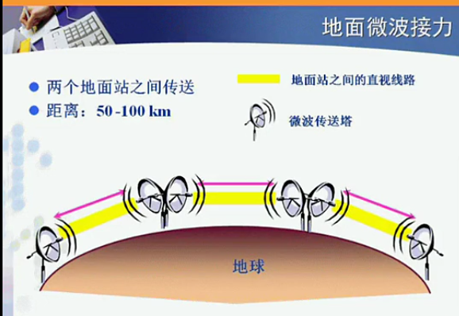

>http://v.youku.com/v_show/id_XNjAyOTEwNjMy.html?spm=a2h0j.8191423.playlist_content.5!11~5~5~A&&f=19689969&from=y1.2-3.4.11

#### 通信线路的通信方式

- 点--点方式
- 多点方式

#### 通信的方式
方向、时间

- 单工通信方式
  - 信息单向传输
  - 发送方，接收方身份固定
- 半双工通信方式
  - 信息双向传输，但不能同时发送
- 全双工通信方式
  - 信息双向传输，可同时进行

|      |        单攻        |  半双工  |      全双工      |
| ---- | ------------------ | -------- | ---------------- |
| 优点 | 用于研究，简化研究 | 用的最多 | 两个信道性能好 |

### 传输介质
- 有线介质
  - 同轴电缆、双绞线、光纤
  - 特点
    - 抗干扰性好
      - 天气
      - 辐射
      - 无线干扰
    - 有线网的协议简单--误码率极低
      - 只需要进行差错检测
    - 安全性
- 无线介质

**传输介质--拓扑结构--传输技术密切相关**

#### 有线介质

##### 1. 双绞线

- 铜线具有较好的传导性能
- 一般情况 铜线普遍指的是双绞线
- 屏蔽层--抗干扰
  - 平时较少使用屏蔽双绞线
    - 网卡也需要对应设施
    - 抗干扰性依然较差
- 价格便宜
  - *考虑价格的时候考虑的*
    - 连接器的设备价格
    - 线的价格
    - 维护的成本
    - 寿命

##### 2. 同轴电缆

- 只适合多点连接
  - 总线型拓扑结构
- 75欧姆同轴电缆只能传输模拟信号
  - 10 base 2
  - 10 base 5
  - 10 broad 35()

##### 光纤

- 通过光信号有无来表示信号
- 需要电光/光电转换设备(所以很少用于全双工)
- 传输模式

  - 多模光纤
    - 距离短
  - 单模光纤
    - 性能好，成本高

#### 无线介质
相比有线介质，无线介质通常只能使用广播的方式，需要解决冲突的问题
- 信号重叠
- 一个信道保证一个数据发送

##### 1. 无线电

- 采用多路复用技术避免冲突
- 采用多基站来解决信号距离问题(蜂窝网络)
  - 相邻基站的频率都是不一样频段范围
    - 没有干扰

##### 2. 微波

##### 3. 同步卫星

- 三颗卫星覆盖全球
- 延时大

### 通信系统指标
#### 1. 时延

时延:一个**数据块**从链路的一端送到另一端用的时间
- 数据块:分组、帧、报文等……
  - 每个层次的关注的不一样
    - 越往上整体来讲包含的环节越多，影响因素就越多

#### 2. 误码率
#### 3. 时延
