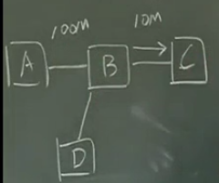

>视频地址
http://v.youku.com/v_show/id_XNjAzMTc2NDc2.html?spm=a2hzp.8253876.0.0&f=19689969

### 具有公用数据通信网的计算机网络(**现代网络模型**)

##### 分组交换
**什么是分组?**
*通信子网能否把原始数据直接传输？*
  - 不能。必须要加一些内容
  - 类比 *写信，信封，地址*

*是否一次性发送大数据包？*
  - **灾难性的**。必须拆分

**分组**:数据有长度上限的数据要求

**分段，等长分段，不等长分段？**
  - 等长分段
    - *ATM网络：53字节，5+48*
    - 数据处理简单
    - 数据利用率低 48/53
  - **不等长分段**
    - 只规定最大长度

##### 节点无法全连接问题
节点无法全连接，两两节点连接问题
  - 方案1：电话线拨号，建立物理连接
    - 实时性高
  - **方案2: 邮局送信模式，一次一次转发**
    - 不会拒绝用户。顶多慢，不会拒绝
    - 选择原因：
      - 历史原因。
      - 对实时性要求不高
      - 线路利用率高

**先存储再转发模式**
  - 纠错
    - 接受-存储-检查-纠错
  - 需要寻址(路由器--路由选择)
    - 接收数据-存储-寻址-寻址完成-发送
  - 不能立即转发
  
    - 多用户
    - 硬件资源不足

####第三阶段 标准化
不同计算机、不同厂商数据无法兼容

  - 厂商标准 IBM-XXXX
    - 无法解决不同厂商的标准
  - 国际标准 ISO-OSI/RM 开放系统互联参考模型
    - 只要遵守我们的规则，就叫 **开放系统**，只要我们是开放系统，就互联
    - [缺]没有实际产品
    - 正式提出了分层模型，相关研究方法与术语
  -  **事实标准** TCP/IP协议集
    - 主流。因为Internet使用他为支持的协议集

### 两个网络发展，至关重要阶段
  -  **局域网**
    - 小规模网络
    - 使用户依赖度增高
  - Internet网络
    - 大规模网络

   **近期概念**

  - 三网合一
    - 电信网、互联网、有线电视网络
      - 物理上连通性
      - 互联性
      - 数据无缝的链接
  - 全光网络
    - 官网与接入网用光纤
  - 物联网

## 网络分类
#### 覆盖范围分类
  - 局域网LAN
    - 几十公里
  - 城域网MAN
  - 广域网WAN
    - 超过局域网范围

**地理范围不同，导致网络结构、传输方式差异很大**
*广播方式仅使用在局域网。资源浪费、冲突*
*局域网所有者只有一个，广域网所有者很多。很多问题，比如中间节点数量(管理的问题)*
**局域网与广域网的方式截然不同**

#### 其他分类方法
  - 传输技术 广播 点到点
  - 通信介质 有线 无线
    - 无线更复杂，容易出错
  - 速率 高速 低速(宽带、窄带)
  - 用户 公网 专网
  - 网络控制 集中式 分布式
    - 特定应用，集中式仍需要
      - 订票系统
  - 网络应用环境
