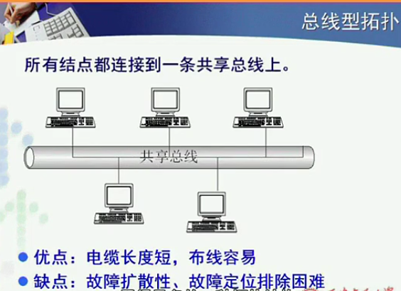
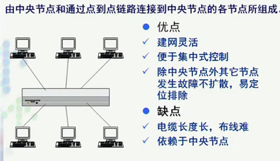
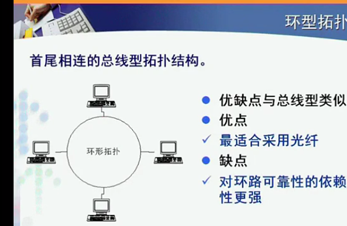
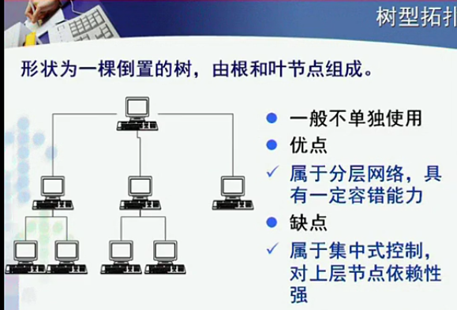
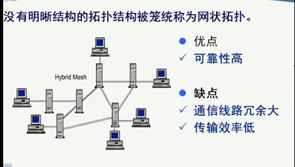
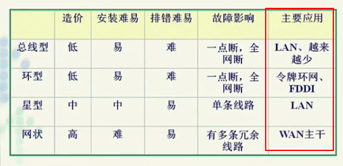
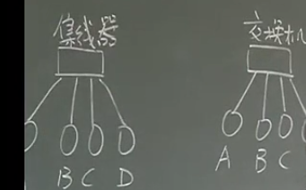

>http://v.youku.com/v_show/id_XNjAzMTc0MzQ4.html?spm=a2h0j.8191423.playlist_content.5!3~5~5~A&&f=19689969&from=y1.2-3.4.3

## 计算机网络的结构
---
 **问题：传输的介质与传输的信道是一个概念么？**
不是。信道：怎样使用物理介质传输

  - 物理结构(拓扑结构)
    - 计算机如何被连接成物理互通的整体的
  - 逻辑结构
    - 数据在物理网络结构中如何互通的

 **拓扑结构**
  - 拓扑学研究点、线构成的图形的特性。
  - 抽象模型研究对计算机网络结构的影响
    - 计算机的位置、数量确定了，如何连接起来

#### 拓扑结构的种类
**选择了拓扑结构，对后续的工作有了限制**
  - 拓扑结构与传输介质相关
  - 传输技术也收到限制

##### 1. 总线型(串行)

  - 局域网发展早期最常见的拓扑结构，局域网
  - 结构简单(广播)
    - 物理连接方式简单，典型的广播形式:一个节点发送，其他节点都能传播
      - 节点发出数据 **双向传输**
        - *两个节点同时发送，信号重叠，导致接收方与发送方数据不一致*
          - 如何解决冲突？
    - 传输方式简单，同上
  - 故障高
    - 一个点故障，全部故障
    - 难排查二分法解决

##### 2. 星形

  - 后来局域网采用这种方式代替1. 总线型
  - 中央节点
    - 连通性，数据中转
    - 数据处理
      - 局域网中有，广域网没有
    - 建网灵活
      - *拔交换机网线插另一个口*
    - 集中式管理
      - *追踪局域网IP，盗IP，网管断网*

##### 3. 环形

  - 上世纪90年代FDDI网络(光纤)
    - 光纤的特性:单向传输、昂贵
  - 单向发送
  - 总线型拓扑结构的首尾相连
  - 需要一个节点删除数据，否则无线循环
    - 发送方，绕一圈
      - 保证所有节点都能收到
      - 绕一圈，占用时间长
    - *为什么不能目的节点，占用时间还短？*
      - 目的节点不存在的情况→导致不能删除
      - 多个目的节点

##### 4. 树形

  - 与其他结构结合，星型树
---
*当网络规模非常大(非局域网)，拓扑结构比较清晰*

##### 5. 网状型

  - 数据传输多条路径
  - 节点与节点不能直接传输

##### 选择拓扑结构考虑的因素
  - 传输介质
  - 介质访问控制方法(数据是如何传输的)
  - 费用、灵活性、可靠性

### 网络的传输方式
---
##### 广播式传输broadcast
  - 基本特点
    - 所有节点共享一条通信 **信道**
    - 任意一台节点发送的数据，其他所有节点都可以接收
      - 不需要中转
      -  同时**会冲突**
  - 关键技术
    - 介质访问控制方法
      - 发现冲突、避免冲突、解决冲突
        - 仲裁者，预约机制--举手发言
          - 违背了简单性原则
            - 协商、规则，复杂效率低
          - 入网时延增加，信道浪费
            - 只有一个时，也要预约
        - 随时发言--必然会产生冲突
          -  **讲前先听**--没有听到别人发言再发言--发现冲突
          -  **变讲边听**--解决冲突
  - 拓扑结构
    - 总线型、环形
  - 适用范围
    - 节点数量少
    - 局域网

##### 点到点式p2p
  - 基本特点
    - 一跳链路连接两个节点
      - 连接主机、或设备
    - 一般情况下，两台计算机传输经过多台网络设备
    - 一般情况下，两台计算机有多条链路选择
  - 关键问题
    - 路由选择问题
      - 选路依据问题
      - 全部详细的路径地点--路由表
        - 详尽到所有的路由节点都有记录
          -  *表的内容特别多，如何存储*
          -  *如何建表，怎么记录所有所有节点*
          -  *表的内容动态变化*
          - **动态内容**
          - **封层压缩**
          - **控制交换规模**
            - 下一节点在哪里
            - 给出的目的不一定精确

          |   目的   | 下一节点 |     |
          | -------- | -------- | --- |
          | 网络范围 |          |     |

*集线器与交换机 区别*

  - 集线器--广播
    - A→中心→BCD
    - 优点
      - 组网代价低
      - 特殊情况时延低
  - 交换机--点到点
    - A→中心→B
    - 表里找不到则广播(有限广播)
    - 较复杂
      - “路由表”
      - 路由表存储
    - **优点(对比)**
      - 带宽利用率高(集线器等分网络带宽)
      - 较难监听
        - 集线器网卡处于混杂模式，B可以听到A到D的信息
        - 交换器网卡处于普通模式，B只可以听到A给D的信息
      - 设备兼容
        - 集线器没缓存，所以要求设备的网卡带宽必须一样100-100-100-100
        - 交换机可以100-10-100-10
      - 网络跨度限制--广播的应对冲突措施对时延有要求
