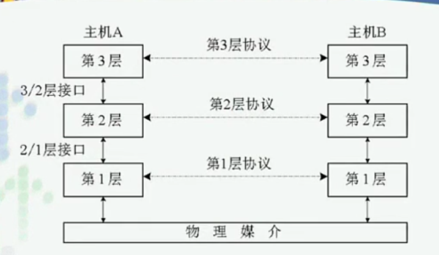

>http://v.youku.com/v_show/id_XNjAyNzQyMDIw.html?spm=a2h0j.8191423.playlist_content.5!4~5~5~A&&f=19689969&from=y1.2-3.4.4

# Chapter2 计算机网络结构

## 目录

- 网络体系结构
  - 分层研究的方法，为什么采用，优点，how
- 接口、服务与协议
  - 描述、定义、术语
- 网络参考模型
  - 开放系统互联参考模型
  - TCP/IP协议集

## 网络体系结构

---

### 分层模型

---

##### **为什么使用分层的结构？**

*不同国家、语言哲学家讨论问题*
- 哲学知识
- 语言--通讯规则
- 拓展，哲学小组

**哲学家-翻译-秘书--分层结构**
- 各层独立
  - 每一层不需要知道下层如何实现
- 灵活性好
  - 某一层改变对全体影响不大
- 结构上分开
  - 每一层使用最合适的技术
- 易于维护和实现
  - “分别招人”
  - 简单问题可靠性更高
- 促进标准化
  - 功能单一、明确

##### 分层思路

- 将问题抽象为多个层次
- 分层实现方法
  - 选择通讯手段
  - 选择保证信息可靠手段
- 注意事项
  - 分层根据功能需要分层
  - 分层的功能明确

##### 三步建立分层法

1. 按照功能进行抽象，划分层次(**层**)
2. 明确每一层完成的功能，明确层跟层的接口(**服务**)
3. 为了保证通信的顺畅，指定通信的规则(**协议**)

##### **实际研究方法**

1. 选取一个模板(范例) ISO/OSI 五层模型
  i. 分层
  ii. 服务
2. 实例
  i. 层次与模板的对应关系
  ii.  协议分析

#### 分层原则

- 分层不能太多，也不能太少
  - 太少，单层功能混乱
  - 太多
    - 效率低
    - 信道浪费大，每一层需要封装，数据在膨胀
      - 数据递交进行**封装**
        - 加入控制信息
- 每一层存在的意义是给上层提供服务
  - 层与层之间以接口传输
  - 提交正确的信息给上层
  - 同层之间协议来交互
  - 完整的通信需要加载整个结构
    - 异构网络需要中间节点进行转换
  - 可以选择合适的技术层，但同层必须使用想同技术
- 最底层来使用物理介质

**每一层**面临的技术
- 编址技术addressing
  - 网卡地址、IP地址，多种地址可共存
- 数据传输 data transferring
- 差错控制 error controlling
  - 差错检测(必须做的)
  - 差错恢复(非必须)
    - FTP--需要
    - 视频点播--不需要
  - 单一层差错控制只保证传输过程中的差错，不保证上传一层差错，不保证其他层的差错
  - 没有任何一种差错控制能保证完全没有差错
- 顺序控制 sequence controlling
  - 顺序
  - 缺失、重复
- 流量控制 flow controlling
  - 收发方处理能力不匹配
    -  *A网卡100Mb B网卡10M*
    -  *A10个缓冲区 B1个缓冲区*
- 拆分与重组 disassembling and reassembling
  - 最大长度限制MTU(最大传输单元)不一样，需要分段
- 复用与解复用 multiplexing demultiplexing
- 路由选择问题 routing
