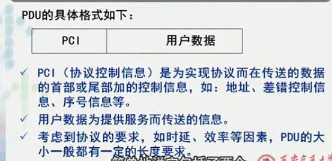

>http://v.youku.com/v_show/id_XNjAyNzQ2MDg0.html?spm=a2h0j.8191423.playlist_content.5!6~5~5~A&&f=19689969&from=y1.2-3.4.6

## 网络体系结构的描述方法

---

##### 实体 对等实体
- 实体 entity
  - **功能落实到实体**
  - 层中的活动单元
  - 可以是软件(进程)，硬件(网卡、芯片)
  - *IP协议落实到IP协议进程*
  - 对等实体:不同子系统，同一层的实体互称对等实体
    - 协议:对等实体之间的通信规则
    - 上层实体、下层实体、对等实体
- 层 layer
  - n层、n+1上层、n-1下层
- 协议 protocol
  - 对等实体之间的通信规则，信息交互规则
  - 保证上层数据传送
  - 满足上层的服务质量QoS
  - 组成部分
    - 语法
      - 数据传输的格式
        - 加控制信息
        - *寄信*:信封、地址
        - 加命令
    - 语义
      - 通讯怎样进行，如何处理信息
    - 定时关系
      - 事件顺序的关系
  - 连接
    - 保证为上层满足服务质量的数据传输
  - 接口&服务
    - 服务:为上层的对等实体提供通信能力
      - 上层能看到的功能叫服务
      - 自己完成的某些功能
      - 向下传输的功能
    - 服务的提供者/用户
      - 提供者--相邻下层
      - 用户--所有上层
    - 接口:
      - 服务访问点SAP(service access point)
        - 定义:上层调用下层是如何调用的
          - 服务的名字
          - 参数
        - 任何层间服务是在接口的SAP上进行的
        - 每个SAP有唯一的识别地址
        - 上层访问下层有多种SAP
        - 静态
          - 同一个SAP在多个进程调用
    - 数据单元 data unit
      - 角度不同 定义不同
        - 协议数据单元 PDU
          - 同一层对等实体，协议控制下
        - 接口数据单元 IDU
          - 上层调用下层接口传送的
        - 服务数据单元 SDU
          - 下层给上层提供服务要求传送的
    - 服务的分类
        - 面向连接的服务
          - 要先建立连接
            - *打电话*
          - 服务有保证
          - 占用专用物理通路
            - 入网时延大
            - 用户有限
        - 无连接的服务
          - *写信*
          - 服务质量不好保证
            - 顺序
            - 丢失

---

1. **PDU 协议数据单元**

      

      - 不同系统对等实体实现(n层给n层)协议所交换的信息
      - **PDU是研究协议的重要线索**
        - 不传输裸数据，加协议控制信息PCI
          - *加在用户数据前面好，后面好？*
            - 前面好(绝大多数放前面)
              - 网络数据传输是串行传输
                - 越靠前越早到达
          - *格式固定好，不固定好*
            - 固定好
              - 处理程序相对简单
              - 缺:灵活性差
          - *长度长好，短好？*
            - 信道利用率、控制程度
          - 各层名称不同
            - 网络层--分组
            - 链路层--帧
            - 传输层--报头
        - 用户数据
          - 协议数据最大长、最小长度
            - 以太网:
              - 最大:1518B=1500+18
                - 分段
              - 最小:64B(10M)
                - 合并
                  - 有很多致命的问题:合并长短等
                - 填充
        - 数据封装&解封
          - 数据膨胀
          - 上层的数据单元是下层数据单元的用户数据部分
          - *例子:FTP协议传输*

          

2. 接口数据单元 IDU

    

      - 相邻层(n+1给n)接口传输的数据单元
        - 接口控制信息ICI
          - 我要传输的数据是怎样/服务质量是怎样
            - *通过多少字节，可靠性怎样*
          - 给n层后丢弃
            - *邮局寄信，“给我寄一封挂号信”(工作人员改了个戳--但具体怎么做不知道)*
3. 服务数据单元SDU

    

      - 上层服务用户所要求传送的数据单元
        - 与PDU的用户数据部分类似
        - 本层服务数据单元=上层协议数据单元对应
          - 因为上层协议数据实际被分段了，而我们需要分段前的整体(即本曾服务数据单元)


```
 N+1        DATA  PDU
        ICI+DATA  IDU
 N(-ICI)    DATA  SDU
 N      PCI+DATA  PDU
```

---

##### 选择服务种类的要素(面向连接、无连接)

1. 所运行的协议的网络环境是怎样
2. 与所选择的服务目的有关

**上层选择提供服务与下层获得的服务类型无关**，但有一定联系
*IP协议无连接-TCP无连接/UDP面向连接*

信息交互通过 **服务原语**(开放性互联参考模型)来描述:
- 请求 request
- 指示 indication
- 响应 response
- 确认 confirm
