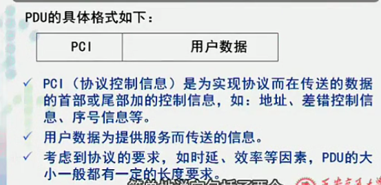

>http://v.youku.com/v_show/id_XNjAyNzQ2MDg0.html?spm=a2h0j.8191423.playlist_content.5!6~5~5~A&&f=19689969&from=y1.2-3.4.6

### 网络体系结构的描述方法

##### 实体 对等实体
- 实体 entity
  - **功能落实到实体**
  - 层中的活动单元
  - 可以是软件(进程)，硬件(网卡、芯片)
  - *IP协议落实到IP协议进程*
  - 对等实体:不同子系统，同一层的实体互称对等实体
    - 协议:对等实体之间的通信规则
    - 上层实体、下层实体、对等实体
- 层 layer
  - n层、n+1上层、n-1下层
- 协议 protocol
  - 对等实体之间的通信规则，信息交互规则
  - 保证上层数据传送
  - 满足上层的服务质量QoS
  - 组成部分
    - 语法
      - 数据传输的格式
        - 加控制信息
        - *寄信*:信封、地址
        - 加命令
    - 语义
      - 通讯怎样进行，如何处理信息
    - 定时关系
      - 事件顺序的关系
  - 连接
    - 保证为上层满足服务质量的数据传输
  - 接口&服务
    - 服务:为上层的对等实体提供通信能力
      - 上层能看到的功能叫服务
      - 自己完成的某些功能
      - 向下传输的功能
    - 服务的提供者/用户
      - 提供者--相邻下层
      - 用户--所有上层
    - 接口:
      - 服务访问点SAP(service access point)
        - 定义:上层调用下层是如何调用的
          - 服务的名字
          - 参数
        - 任何层间服务是在接口的SAP上进行的
        - 每个SAP有唯一的识别地址
        - 上层访问下层有多种SAP
        - 静态
          - 同一个SAP在多个进程调用
    - 数据单元 data unit
      - 角度不同 定义不同
        - 协议数据单元 PDU
          - 同一层对等实体，协议控制下
        - 接口数据单元 IDU
          - 上层调用下层接口传送的
        - 服务数据单元 SDU
          - 下层给上层提供服务要求传送的
    - PDU

      

      - 不同系统对等实体实现协议所交换的信息
        - 不传输裸数据，加协议控制信息PCI
          - *加在用户数据前面好，后面好？*
            - 前面好(绝大多数放前面)
              - 网络数据传输是串行传输
                - 越靠前越早到达
          - *格式固定好，不固定好*
          - *长度长好，短好？*
