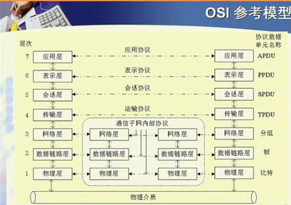

>http://v.youku.com/v_show/id_XNjAyNzgxMjUy.html?spm=a2h0j.8191423.playlist_content.5!7~5~5~A&&f=19689969&from=y1.2-3.4.7

## 网络体系结构的实例

---

### 开放系统互联参考模型OSI

*外层是计算机，内层是路由器*
- 第三层--通信子网
- 高三层--资源子网
- 传输层--承上启下

1. 层次结构不一样，或协议不同，不能 **直接**通信
2. 资源子网与通信子网通信时层次可以不一样
    - 通信子网内只解决数据传输问题，不关注内容

##### 物理层
- 主要功能
  - 物理介质上发送、接受二进制位流(比特流)‘’
  - 解决点到点的问题
    - 只要发送就能接受，不需编制
    - 确保每一二进制位能收到，且识别
      - 机械特性
        - *水晶头--RJ45*
          - 大小尺寸
          - 引脚排列
          - 规格
          - 锁定装置
      - 电器特性
        - 电压/电流，光信号/电信号，脉冲宽度、频率、最大距离
      - 规程特性
        - 同步
          - 接收方按发送方的频率
          - 识别起始、结束位置
            - *以太网:频率:101010、起始位置10101011*
      - 其他规定
        - 引脚……
  - 解决不了的问题
    - 总线型结构 A--BC
    - 无法识别数据传输错误

##### 数据链路层
在物理线路上提供**可靠**的数据传输，对二进制位流增加适当控制，使得上层可以的无错链路
- 功能
  - 物理地址
    - 唯一标识，判断是否接受数据的唯一标准
    - 全球唯一，硬件绑定
  - 成帧(数据单元)
    - 加控制信息
  - 定界、同步
    - 帧的起始位置、结束控制
  - 差错控制
    - 基础二进制位流增加控制信息

    

      - 按照约定给数据位m加冗余位r
        - r是固定的(保证效率)
      - 检查数据位与冗余位关系
        - 不满足--出错
        - 满足--“认为”没错
  - 流量控制
    - *如何获得接收方的接受能力，如果变化如何知晓？*
  - 信道的访问控制问题
    - *广播下如何解决冲突？*

##### 网络层
*解决问题:广域网中无法保证节点直接相连(转接)*

源节点与目的节点提供 **端到端(不是直接相连)** 的数据传输。
**网络层是通信子网最上层，代表通信子网提供服务的/网络层提供上层的服务就是通信子网提供的服务**，基于设计原则，提供的服务差异很大
- 功能
  - **路由选择**
    - 统一编址
      - *为什么不能以物理地址(网卡地址)来转发？*
      - *IP地址与物理地址的关系？*
  - 数据分组转发
  - 流量控制和壅塞控制
  - 差错检测与恢复
