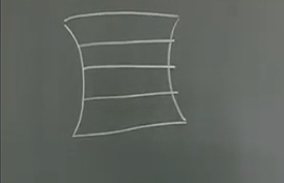

>http://v.youku.com/v_show/id_XNjAyODI2NDk2.html?spm=a2h0j.8191423.playlist_content.5!8~5~5~A&&f=19689969&from=y1.2-3.4.8

##### 传输层
为 **源端主机到目的端(主机到主机)** 主机提供可靠满足服务质量要求的数据传输

---
- 网络层--通讯子网端到端
- 传输层--资源子网端到端
---
**承上启下**
- 屏蔽通讯子网的实现细节、技术差异，使上层不受下层影响
- 上层调用通讯子网时，上层提出的要求通讯子网满足不了，所以由传输层来弥补
  - 纠错
  - 可靠性
  - 重传
  - ……
- 提供进程级通讯能力
  - 端口号--传输层地址
    - 寻址:IP地址-->通讯子网-->物理地址-->端口号

##### 会话层

##### 表示层

##### 应用层
为用户的应用程序提供网络通信服务(唯一与终端层提供网络服务，为用户调用网络的接口)
应用层种类繁多(需求多)

*OSI的会话层、表示层*为了简化应用层功能，来简化应用层:
- 会话层:管理不同机器的会话
- 表示层:数据格式表示的问题

-->why流行五层模型
这些功能并非每个应用层都出现，即使出现解决办法不同

##### 总结
- 应用层--报文--做什么
- 表示层--报文--怎么描述
- 会话层--报文--何时开始、何处开始
- 传输层--报文--对方在何处
- 网络层--分组、包--走哪条路
- 链路层--帧--每一步该怎么走
- 物理层--比特--如何利用物理链路

---

### 案例:TCP/IP 参考模型

- 20世纪70年代产生
- Internet支撑协议，应用最广泛
- 产生遵循了按需要制定协议的原则(非按分层的设计思路)
  - 先点到点
  - 再端到端
  - 再传输层

#### 与OSI对应关系

|    OSI     |   TCP/IP   |
| ---------- | ---------- |
| 应用层     | 应用层     |
| 表示层     |            |
| 会话层     |            |
| 传输层     | 传输层     |
| 网络层     | 网际层     |
| 数据联络层 | 网络接口层 |
| 物理层     | ^          |

#### 协议实现
- 网络接口层:TCP/IP协议集把物理层和数据链路层和起来称为网络接口层
  - 没有具体的协议
    - 只提供接口，根据需要增加
      - *以太网卡*
- Internet层:控制通信子网提供源节点到目的节点的IP包传送
  - 以IP为核心
- 传输层:提供端到端的数据传送服务
  - TCP UDP
- 应用层:提供各种Internet管理和应用服务功能
  - FTP、SMTP……

**网络接口层、应用层协议的数量发散增加**
- 优点:
  - 简单灵活易实现
  - 充分考虑不同用户的需求
- 缺点:
  - 不适合做模板
    - 没有区分出协议、接口、服务的概念
  - 必须与其他协议协作才能工作(无接口协议)

  --
