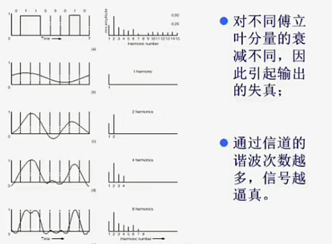
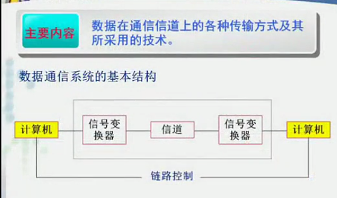
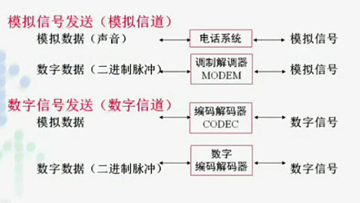
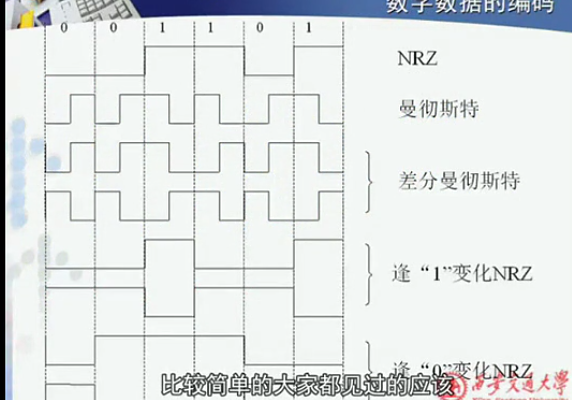
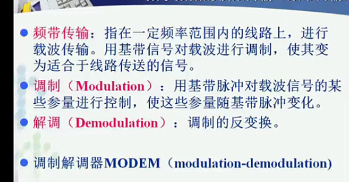
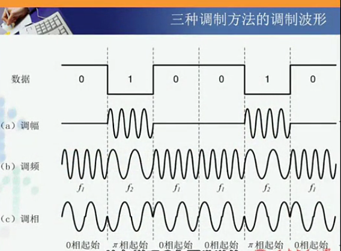
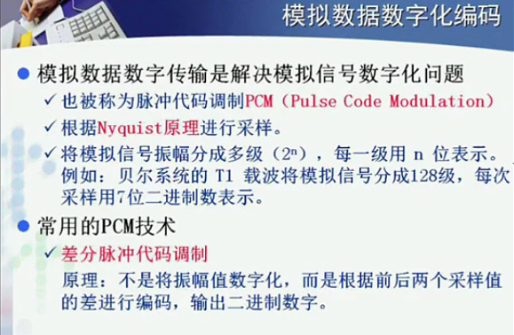
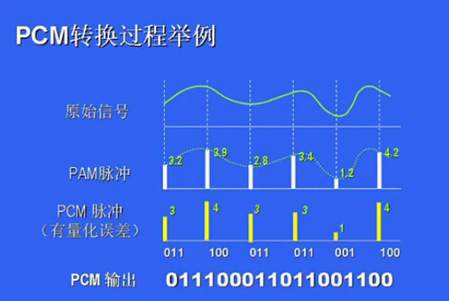
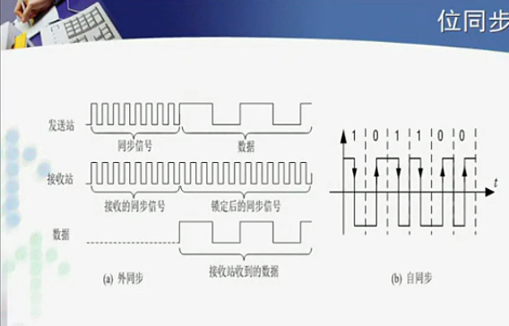
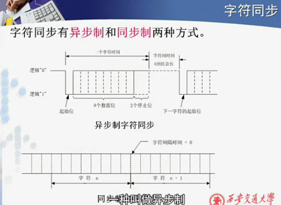

>http://v.youku.com/v_show/id_XNjAyNzcxNTUy.html?spm=a2h0j.8191423.playlist_content.5!9~5~5~A&&f=19689969&from=y1.2-3.4.9

>http://v.youku.com/v_show/id_XNjAyODU2MDUy.html?spm=a2h0j.8191423.playlist_content.5!10~5~5~A&&f=19689969&from=y1.2-3.4.10

# 第三章 数据传输技术
## 目录
- 数据通信的理论基础
- 传输介质
- 数据编码
- 信道复用技术
- 数据交换技术
- 物理层规程

## 数据通信的理论基础
**主要内容:信号再通信信道上传输的时的数学表示及所受限制**

- 串行传输
- 数字信号

1. 通过利用电压、电流表示二进制位流
2. 时间f(t)的函数

- 研究数学基础--傅立叶分析:任何周期为T的函数gt，都可以表示为无限个正弦和余弦函数
  - 原因:通信系统不是理想的(所有频率的波都能通过)，频率有通过范围。通过波形越多，越接近原始发送波形。
  - 研究:研究一个通信系统允许多少次不同波段的谐波通过的过程，才能还原原始发送波形

  

### 数据通信系统模型

- 对于通信的两台计算机，把物理介质看作信道(单条介质分成多个信道)
- 信号变换器
  - 数字信息(0，1)无法直接在介质上传输
    - 数字信息无法在模拟信道上传输
    - 多个1，若不变换，可能变成较长直流
  - 信息-->数据-->信号
- 数据表示
  - 传输方式
    - 模拟信号
    - 数字信号
  - 发送方式
    - 模拟信道
    - 数字信道
      - 传输数字信号代价地
      - 易于加密，安全性高
      - 具有综合业务能力:可以传输多路数据
        - *电信ISDN*:上网、电话互不影响
  - 四种组合

  

1. 模拟信号-模拟信道

*模拟信号本身频率相似，如何防止传输重叠？*
- 低通滤波器，过滤杂波，高于3400赫兹，避免干扰其他电台
- 调制。把频率调到分配给他的频段
- 解调。接收特定频段的信号

2. 数字信号-模拟信道

调制解调--数模信号转换

3. 模拟信号-数字信道

编码解码
4. 数字信号-数字信道(重点讨论)

为达到服务质量，数字信号也需要进过编码再传输

### 基带传输和频带传输
- 基带信号
  - 数据源发出的没有经过处理调制的原始电信号
  - 数字源-数字基带信号
  - 模拟源-模拟基带信号
- 基带传输--数字基带信号传输
  - 10 base Trans
- 频带传输--模拟。。
  - 10 broad 36

##### 1. 基带传输
- 电压高地分别表示0，1
- 核心内容:**编码方式**
  - 直接影响位传输速度

- 曼彻斯特编码
  - 自同步能力:接受可以识别发送的频率(无需同步信号)
  - 没有直流分量的累计
  - 缺:降低了传输速率，只有1/2介质传输速率
- 差分曼彻斯特编码
  - 前后有变化为0，没有变化为1
    - 解决反向错误:高低电位错误
      - 实现复杂

##### 2. 频带传输

数字-->载波
- 调制解调器--波形转换
  - 幅度、频率、相位，三种技术
    - 调幅
    - 调频
    - 调相

##### 3. 模拟数据的数字化编码

- 采样
  - 尽可能不失真
  - 结果容量小

采样(误差)-->量化(误差)-->编码
*联想:听音乐320mps码率MP3，无损格式*
- 采样频率越高，失真越小
- 编码采用位数越大，失真越小

### 数据同步方式
同步解决的问题:
1. 收发方频率一致问题
(只有物理层需要解决)
2. 收发方能够确定发送方的起止位置
(每一层都要做)

- 层次不同，同步技术有差距
  - 物理层--位--位同步
  - 数据链路层--帧--帧同步
  - 字符同步
    -
  - 。。。

##### 1. 位同步

交付:频率+起止位置

- 外同步
  - 同步信号+信息
    - 以太网8字节控制信息 10101010-。。。-10101011
      - 前七个频率，后一个起始位置
- 自同步
  - 信号本身可以提取频率信息

##### 2. 字符同步

- 异步制
  - 8位字节--> 起始位1+数据位8+终止位2
  - 每个字符独立定界
    - 字符出错不会影响别的
    - 由冗余信息，利用率不高
- 同步制
  - 先确定频率和开始和字符位长度
    - 开始，8，8，8，8，8……
  - 定界与前后相关
    - 不能停顿、不能出错
