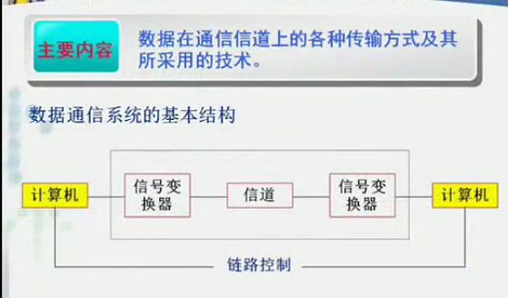
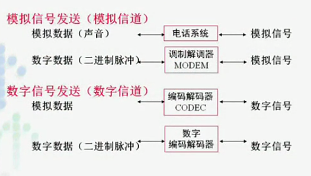

>http://v.youku.com/v_show/id_XNjAyNzcxNTUy.html?spm=a2h0j.8191423.playlist_content.5!9~5~5~A&&f=19689969&from=y1.2-3.4.9

# 第三章 数据传输技术
## 目录
- 数据通信的理论基础
- 传输介质
- 数据编码
- 信道复用技术
- 数据交换技术
- 物理层规程

## 数据通信的理论基础
**主要内容:信号再通信信道上传输的时的数学表示及所受限制**

- 串行传输
- 数字信号

1. 通过利用电压、电流表示二进制位流
2. 时间f(t)的函数

- 研究数学基础--傅立叶分析:任何周期为T的函数gt，都可以表示为无限个正弦和余弦函数
  - 原因:通信系统不是理想的(所有频率的波都能通过)，频率有通过范围。通过波形越多，越接近原始发送波形。
  - 研究:研究一个通信系统允许多少次不同波段的谐波通过的过程，才能还原原始发送波形

  

### 数据通信系统模型

- 对于通信的两台计算机，把物理介质看作信道(单条介质分成多个信道)
- 信号变换器
  - 数字信息(0，1)无法直接在介质上传输
    - 数字信息无法在模拟信道上传输
    - 多个1，若不变换，可能变成较长直流
  - 信息-->数据-->信号
- 数据表示
  - 传输方式
    - 模拟信号
    - 数字信号
  - 发送方式
    - 模拟信道
    - 数字信道
      - 传输数字信号代价地
      - 易于加密，安全性高
      - 具有综合业务能力:可以传输多路数据
        - *电信ISDN*:上网、电话互不影响
  - 四种组合

  

  1. 模拟信号-模拟信道
模拟信号本身频率相似，如何防止传输重叠？

  2. 数字信号-模拟信道
